# GAN collections in Tensorflow

Tensorflow implemetation of various GANs on MNIST.

# Generative Adversarial Networks (GANs) Papers

Name | Paper Link 
:---: | :---: |
GAN | [Arxiv](https://arxiv.org/abs/1406.2661)
WGAN | [Arxiv](https://arxiv.org/abs/1701.07875)
WGAN-GP|[Arxiv](https://arxiv.org/abs/1704.00028)
LSGAN| [Arxiv](https://arxiv.org/abs/1611.04076)
DRAGAN| [Arxiv](https://arxiv.org/abs/1705.07215)
CGAN| [Arxiv](https://arxiv.org/abs/1411.1784)|
infoGAN| [Arxiv](https://arxiv.org/abs/1606.03657)


# Access to Data

Download `mnist.npz` from https://storage.googleapis.com/tensorflow/tf-keras-datasets/mnist.npz .

Put it into `data/mnist`.

# Usage

Train a `wgan` with gradient clipping to -0.05 to 0.05, with D and G using CNN structure, `D:G=5:1`.

```shell
python main.py --gan_type wgan --net_type cnn --clip 0.05 --D_iter 5 --epoch 10 
```

Execute `run.sh` to train all models and generate images.
```shell
./run.sh
```

Clean figs, checkpoints and logs of one model.

```shell
python main.py --todo clear --gan_type gan --net_type cnn  
```

# Generation

Name | Epoch 0 | Epoch 5 | Epoch 9
:---: | :---: | :---: | :---: |
GAN | 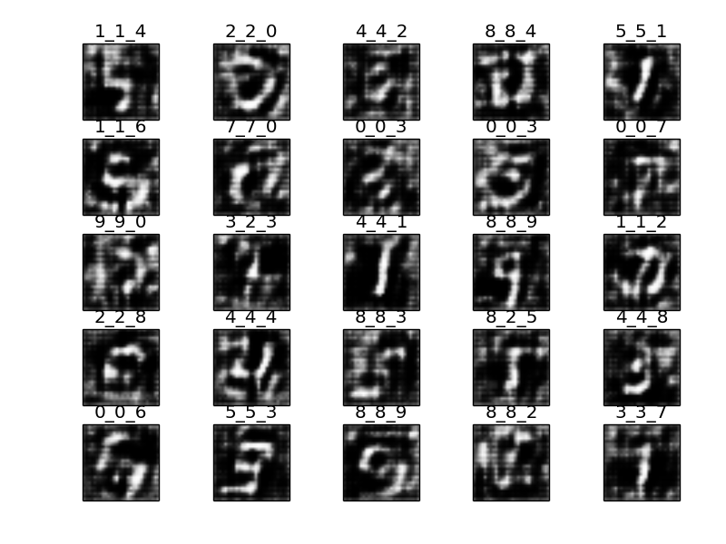 |  | 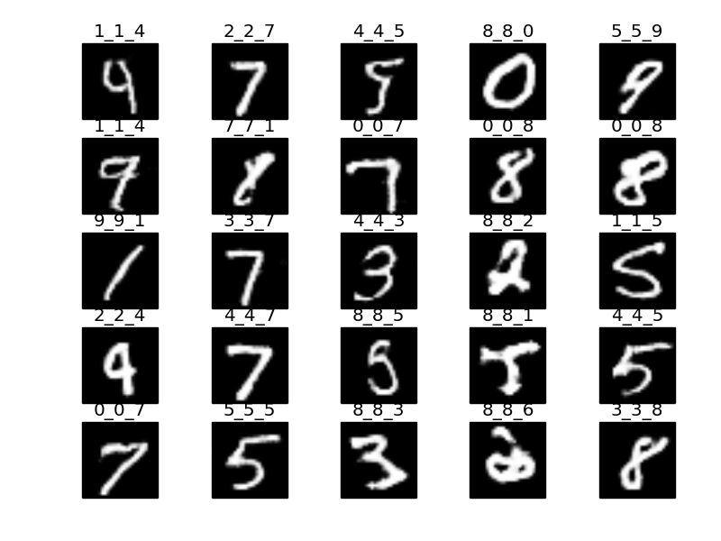
WGAN | 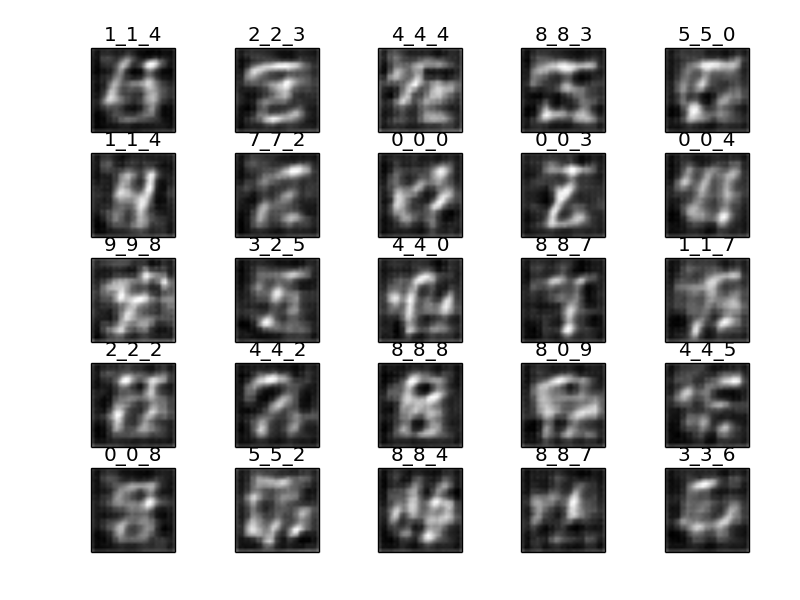 | 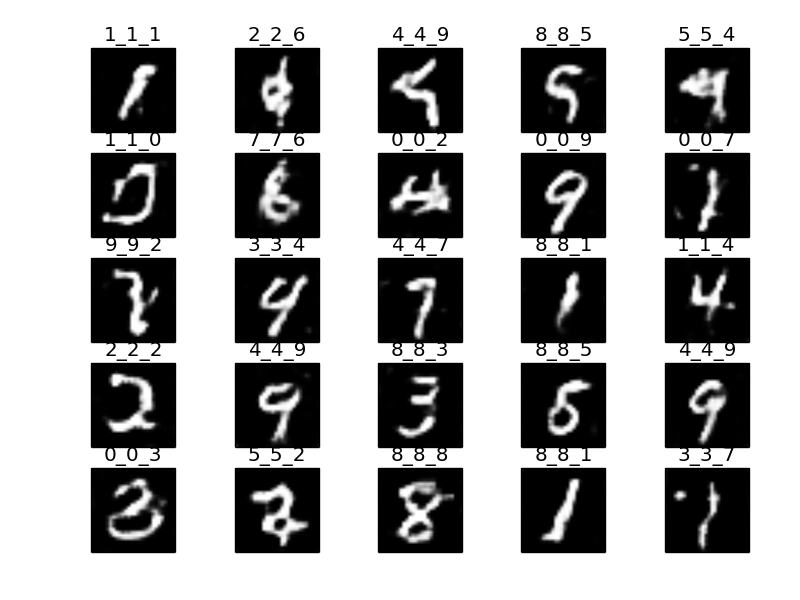 | 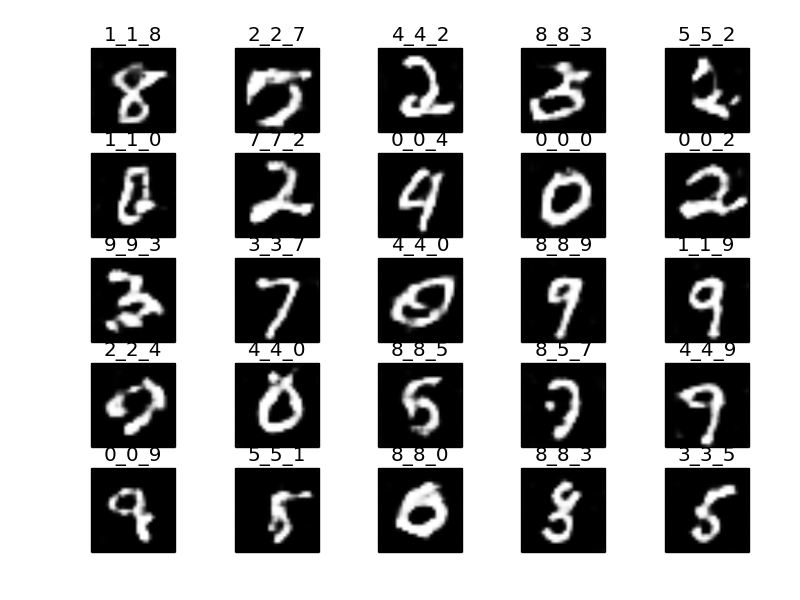
WGAN-GP | 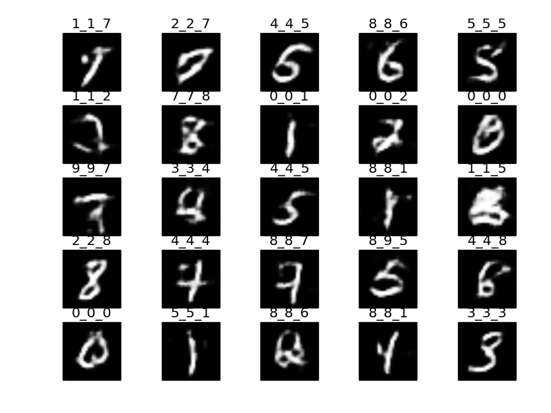 | 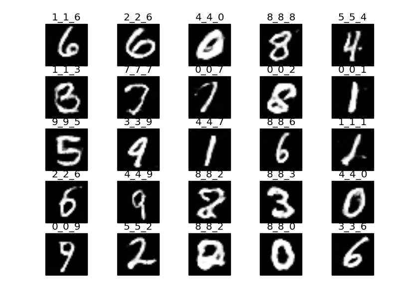 | 
LSGAN |  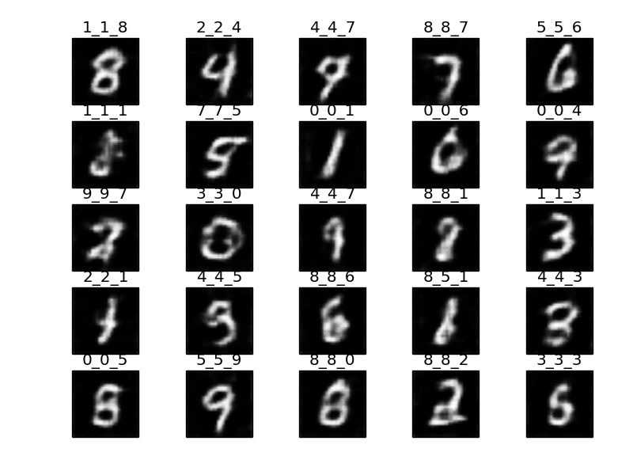 | 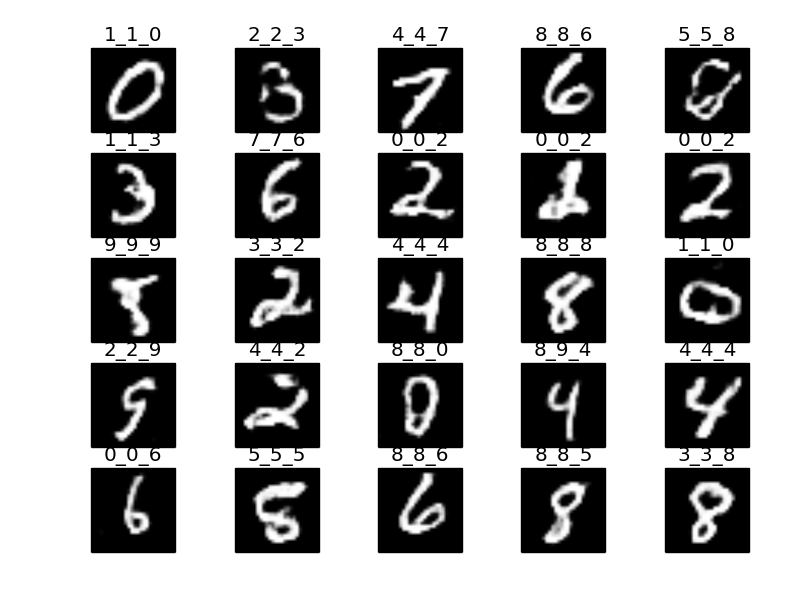 | 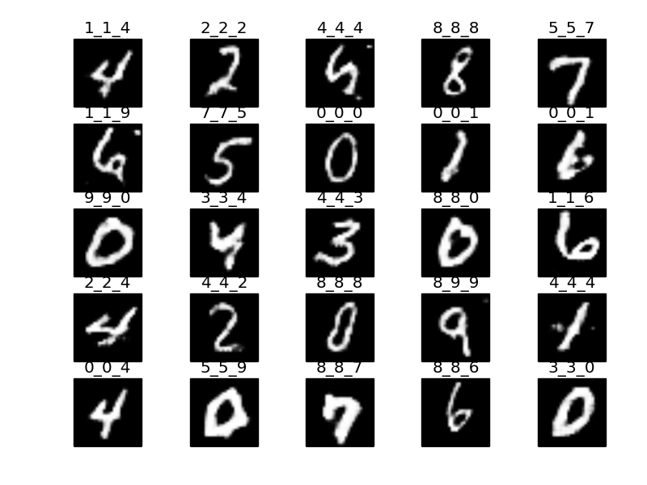
DRAGAN |  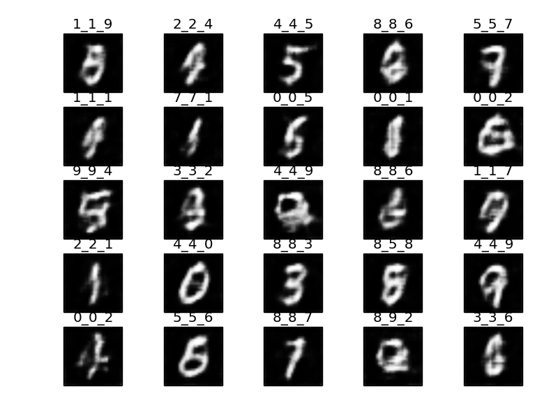 | 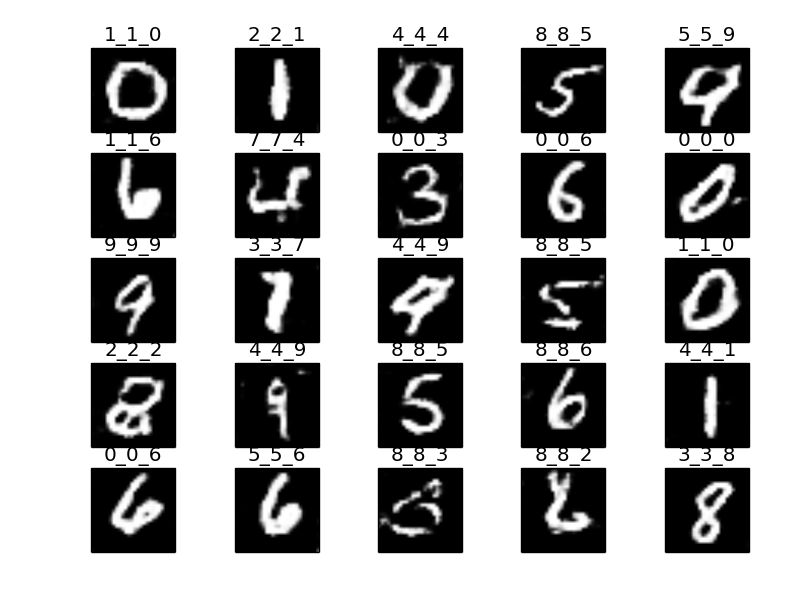 | 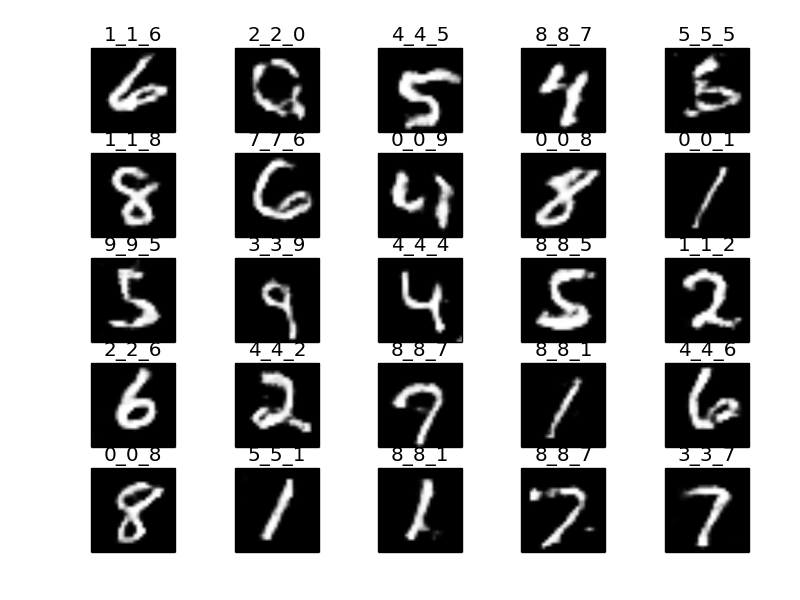

# Reference

## Codes

- [tensorflow-generative-model-collections](https://github.com/hwalsuklee/tensorflow-generative-model-collections)
- [sngan_projection](https://github.com/pfnet-research/sngan_projection)
- [Spectral_Normalization-Tensorflow](https://github.com/taki0112/Spectral_Normalization-Tensorflow)
- [WassersteinGAN](https://github.com/shekkizh/WassersteinGAN.tensorflow)
- [gan_practice](https://github.com/handspeaker/gan_practice)

## CNN structure

[G and D in tensorflow-generative-model-collection](https://github.com/hwalsuklee/tensorflow-generative-model-collections/blob/master/GAN.py)

## MLP structure

[G and D in Simple-GAN-MNIST](https://github.com/hdidwania/Simple-GAN-MNIST/blob/master/gan_code.ipynb)

